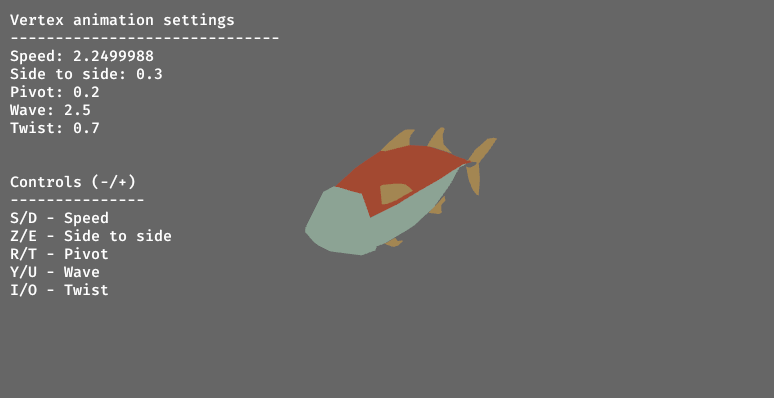

# Vertex_animation

This example showcases how to do animation (in this case, animating a fish) using only a vertex shader .
It is a very powerfull and yet simple method, and "programmer friendl" as it does not require any complex visual assets with IK etc.

This example is based both on some of my older work with vertex shader animation and [this amazing tutorial for the Godot engine](https://docs.godotengine.org/en/stable/tutorials/performance/vertex_animation/animating_thousands_of_fish.html)

## Information

- the Bevy/ Rust code is [here](/examples/vertex_animation/fishy.rs)
- the shader itself is [here](/assets/shaders/fish-wave.wgsl)

## Limitations / issues

- the gltf loader seperates the materials into different meshes, so there is no single AABB for the whole model, whichs leads to some visual bugs (cracks between the fins & the body etc)
- shadows do not work correctly as Bevy (as of 0.9.1) does not yet support correct shadows of meshes deformed with vertex shaders out the box
- there is no shading in this demo, just vertex colors (Perhaps Bevy has a way of using the Standard Material Pixel shader with a custom vertex shader but I have not 
found a way to do this yet)

## Credits

- the authors of the original Tutorial 
- The fish model in this tutorial is made by QuaterniusDev and is shared with a creative commons license. 
CC0 1.0 Universal (CC0 1.0) Public Domain Dedication https://creativecommons.org/publicdomain/zero/1.0/

## License

This example is licensed under MIT.